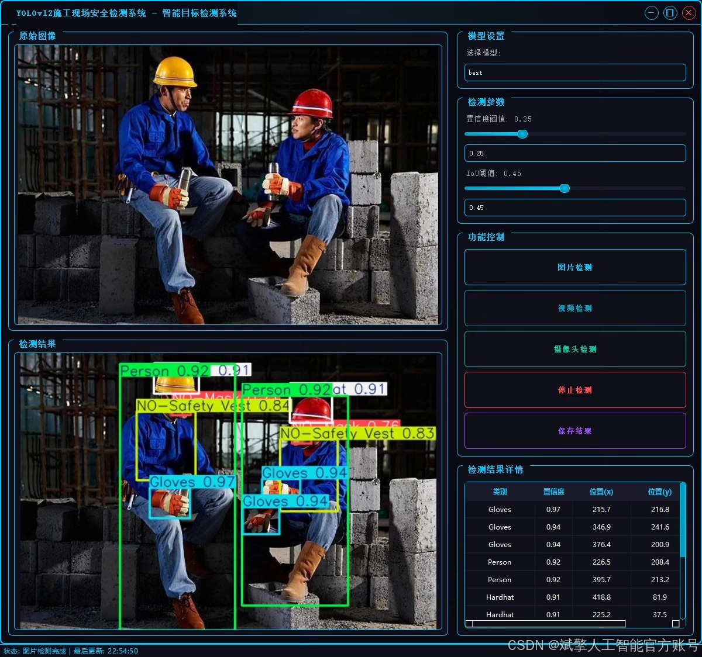
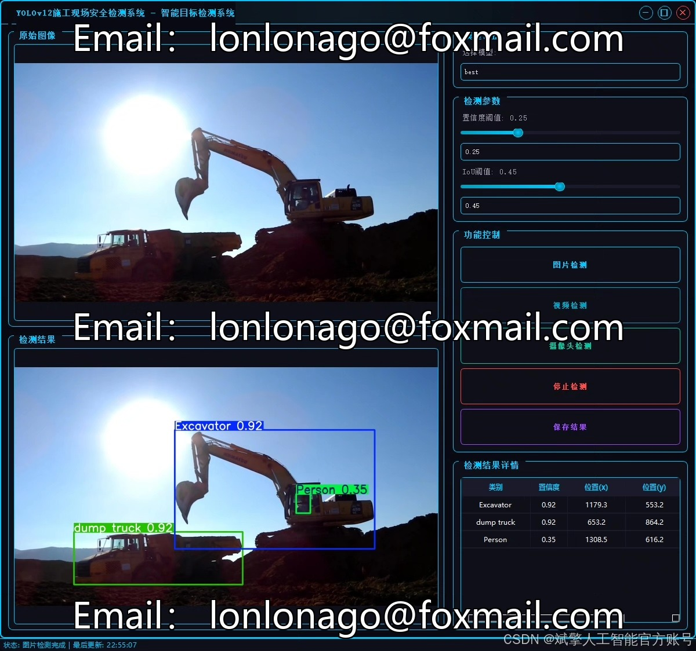
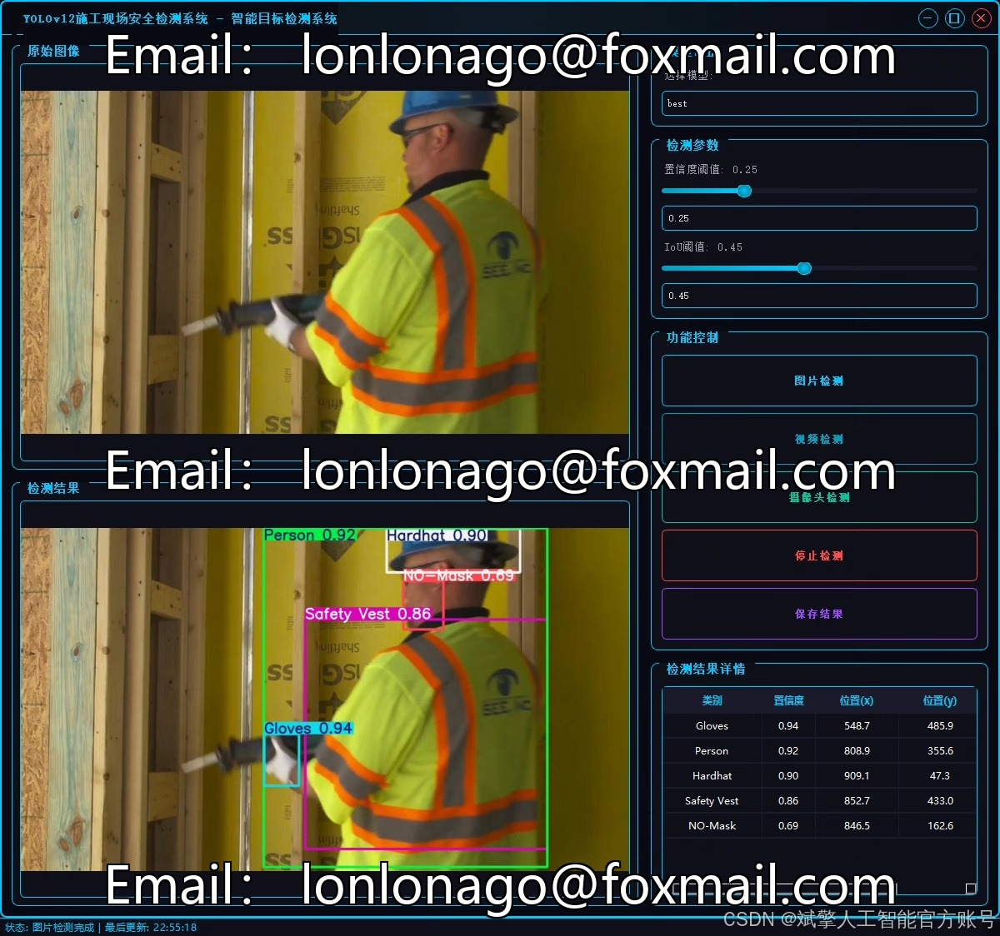
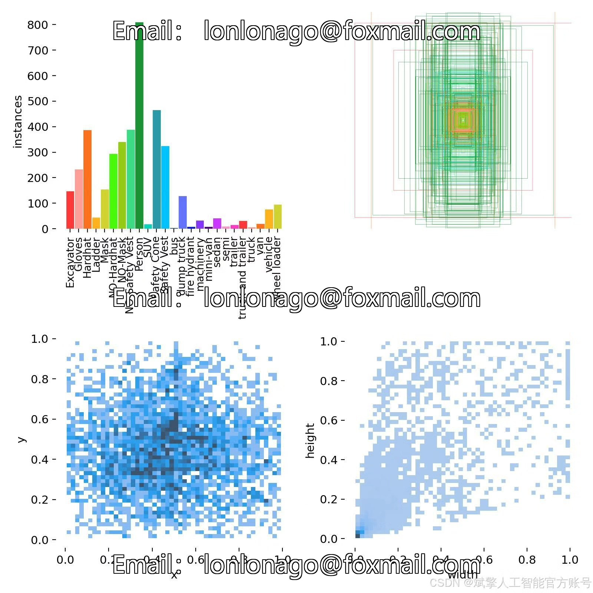
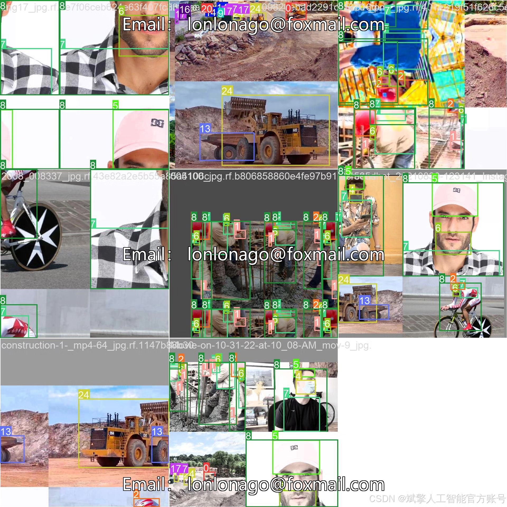
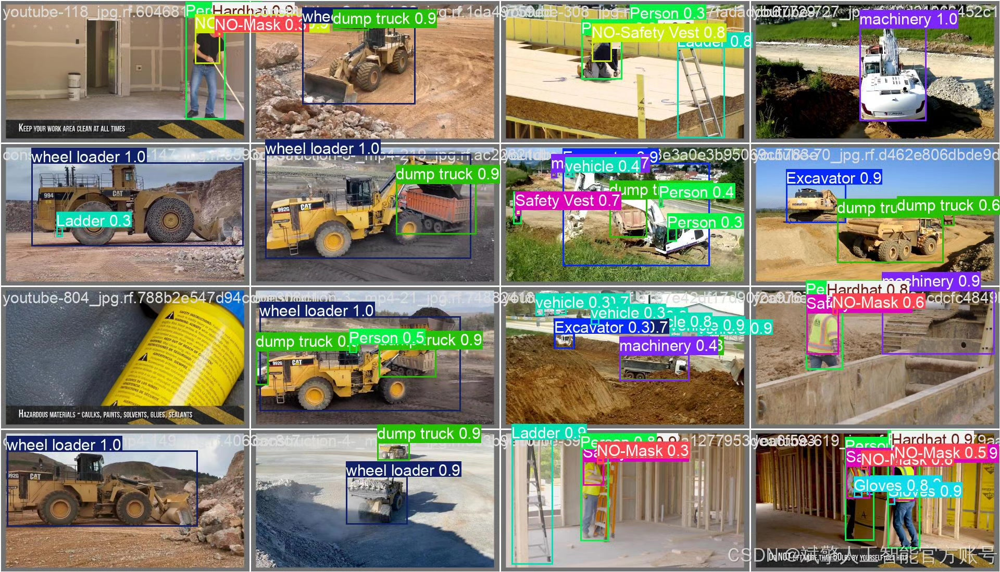

# YOLOv12 Construction Safety Detection System

## Body

The construction site safety detection system based on deep learning YOLOv12 (YOLOv12+YOLO dataset + UI interface + login and registration interface + Python project source code + model)

Construction site safety management is an important link to ensure the safety of workers and the smooth progress of projects. In response to the problems of low efficiency and poor real-time performance in traditional manual inspections, this paper designs and implements a construction site safety detection system based on the YOLOv12 deep learning algorithm. This system can detect 25 types of targets in the construction site in real time (such as engineering vehicles, safety equipment, personnel, etc.), and identify violations (such as not wearing helmets, masks, etc.).

Dataset:
nc: 25
names: ['Excavator', 'Gloves', 'Hardhat', 'Ladder', 'Mask', 'NO-Hardhat', 'NO-Mask', 'NO-Safety Vest', 'Person', 'SUV', 'Safety Cone', 'Safety Vest', 'bus', 'dump truck', 'fire hydrant', 'machinery', 'mini-van', 'sedan', 'semi', 'trailer', 'truck and trailer', 'truck', 'van', 'vehicle', 'wheel loader'],
dataset quantity: 521 training sets, 114 validation sets, and 82 test sets.

✅ User login and registration: Support password detection and security verification.
✅ Three detection modes: Based on the YOLOv12 model, support image, video, and real-time camera detection, accurately recognize targets.
✅ Dual-screen comparison: Display original images and detection results on the same screen.
✅ Data visualization: Real-time table displaying the category, confidence, and coordinates of detected targets.
✅ Intelligent parameter adjustment: Offer a confidence slide bar, dynamically optimize detection accuracy to meet different scene needs.
✅ Sci-fi style interactive interface: Dark theme combined with dynamic light effects, reducing visual fatigue and improving operational experience.

## Images

## Payment

Here is a pay link on Stripe ( https://buy.stripe.com/3cs8yP7sY87d0vu9AB ). Please contact me lonlonago@foxmail.com after funding $89, and I will send you a complete data files , thank you!

